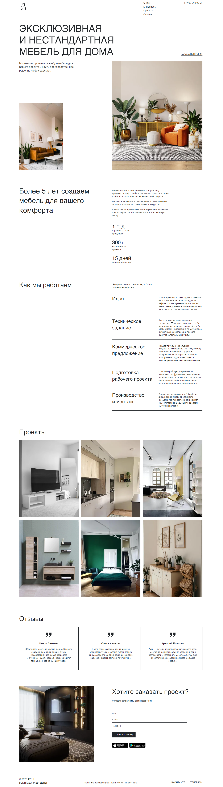

# Мебель для дома

## Описание
Одностраничный сайт для мебельной компании, которая занимается производством и продажей дизайнерской мебели любой сложности.
Сайт сделан по макету в Figma и имеет адаптивный интерфейс под различные размеры экранов и устройств.
Верстка произведена с примением методологии БЭМ.

## Технологии:
- HTML
- SCSS
- JavaScript

## Обзор

